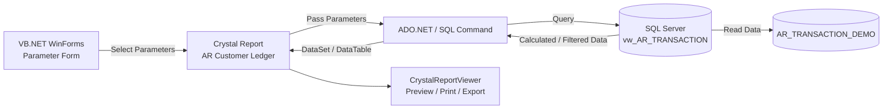

# 📊 AR Master Ledger — Customer Ledger Report

A professional **Accounts Receivable (AR) Customer Ledger** desktop application built with **VB.NET, Crystal Reports, and Microsoft SQL Server**.

The application allows users to generate a print-ready customer ledger with flexible filtering by **date range, customer range, and account-set range**, along with both **summary and transaction-level detail views**.

> **Disclaimer:** This is a demo/portfolio project. All customer names, transaction data, invoice numbers, amounts, and other business data used in this repository are fictional dummy data. No real company or customer data is included.

---

## 📌 Project Overview

**AR Master Ledger** is designed to demonstrate how an ERP-style **Accounts Receivable Customer Ledger** can be developed using VB.NET, SQL Server, and Crystal Reports.

The application provides:

* Customer-wise ledger reporting
* Account Set-wise grouping
* Opening and closing balance calculation
* Debit and Credit transaction tracking
* Transaction-level journal details
* Date, Customer ID, and Account Set filtering
* Ageing / Days Over calculation
* Crystal Reports preview, printing, and export functionality

The project uses a simplified demo database structure so that the SQL logic and reporting workflow can be shared publicly without exposing any proprietary ERP database structure.

---

## 🖼️ Screenshots

### Main Parameter Form


The parameter form allows users to select:

* From Date / To Date
* From Customer ID / To Customer ID
* From A/C Set ID / To A/C Set ID
* Customer Detail Journals option

After selecting the required parameters, users can click **Show Report** to generate the ledger.

---

### 📄 Summary Report

When **Customer Detail Journals** is unchecked, the report displays a summarized ledger view.

| Parameters                                                                                                                                      | Report Output                                                                                                                                                |
| ----------------------------------------------------------------------------------------------------------------------------------------------- | ------------------------------------------------------------------------------------------------------------------------------------------------------------ |
|  |  |

The summary view provides customer/account-set level balances without displaying individual transactions.

---

### 📑 Detailed Customer Journal

When **Customer Detail Journals** is enabled, the report displays transaction-level details.

| Parameters                                                                                                                                                      | Report Output                                                                                                                                                 |
| --------------------------------------------------------------------------------------------------------------------------------------------------------------- | ------------------------------------------------------------------------------------------------------------------------------------------------------------- |
|  |  |

The detailed report includes individual transactions along with running:

**Opening → Debit → Credit → Closing Balance**

---

## 📄 Sample Reports

### Detailed Customer Ledger

[View Detailed Customer Ledger PDF](AR_Master_Ledger/docs/customer%20ledger%20dummy%20with%20details.pdf)

Transaction-level customer ledger with running balances and grand totals.

### Summary Customer Ledger

[View Summary Customer Ledger PDF](AR_Master_Ledger/docs/customer%20ledger%20dummy%20without%20details.pdf)

Summarized customer ledger without individual transaction details.

---

## 🎥 Application Demo

A complete walkthrough demonstrating parameter selection, filtering, report generation, and Crystal Reports output.

<a href="https://drive.google.com/file/d/14zHBKjMsyCiGkCaJOf1O0vNxzHj24Wzn/view?usp=drive_link" target="_blank">

🎬 **Watch Application Demo**

</a>

---

## ✨ Key Features

* 📅 **Date Range Filtering**
* 👤 **Customer ID Range Filtering**
* 🏦 **Account Set Range Filtering**
* 📑 **Summary Ledger View**
* 📋 **Transaction-Level Detail View**
* 💰 **Opening Balance Calculation**
* ➕ **Debit Calculation**
* ➖ **Credit Calculation**
* 💵 **Closing / Running Balance**
* 📊 **Account Set-wise Subtotals**
* 🧮 **Grand Total Calculation**
* ⏱️ **Days Over / Ageing Calculation**
* 🖨️ **Print-Ready Crystal Reports**
* 📤 **PDF / Excel / Word Export**
* 🗃️ **SQL Server-based Data Processing**

---

## 🧰 Technology Stack

| Layer              | Technology                            |
| ------------------ | ------------------------------------- |
| Application        | VB.NET                                |
| UI                 | Windows Forms                         |
| Framework          | .NET Framework                        |
| Reporting          | SAP Crystal Reports for Visual Studio |
| Database           | Microsoft SQL Server                  |
| Query Language     | T-SQL                                 |
| Data Access        | ADO.NET                               |
| Report Data Source | SQL Server View                       |

---

## 🏗️ Application Architecture



### Workflow

1. User selects report parameters from the VB.NET form.
2. The application passes the selected parameters to the report/data layer.
3. SQL Server processes the required transaction data.
4. The SQL View calculates running balances and other derived values.
5. Crystal Reports receives the processed data.
6. The report is displayed through `CrystalReportViewer`.
7. Users can preview, print, or export the report.

---

# 🗄️ Database Design

For this public demo, the database has been simplified into **one transaction table and one SQL View**.

This simplified structure demonstrates the reporting logic without exposing any proprietary ERP database schema.

---

## 1. Demo Transaction Table

```text
dbo.AR_TRANSACTION_DEMO
```

### Main Columns

| Column              | Data Type    | Description                         |
| ------------------- | ------------ | ----------------------------------- |
| `ID`                | INT IDENTITY | Primary key                         |
| `TransactionDate`   | DATE         | Transaction date                    |
| `TransactionType`   | VARCHAR      | Invoice, Receipt, Credit Note, etc. |
| `IDCUST`            | VARCHAR      | Customer ID                         |
| `[DOC NUMBER]`      | VARCHAR      | Transaction document number         |
| `AppliedDocument`   | VARCHAR      | Related/applied document            |
| `NAMECUST`          | NVARCHAR     | Customer name                       |
| `IDACCTSET`         | VARCHAR      | Account Set ID                      |
| `TEXTDESC`          | NVARCHAR     | Account Set description             |
| `CNTBTCH`           | INT          | Batch number                        |
| `CNTITEM`           | INT          | Entry number                        |
| `SourceCode`        | VARCHAR      | Transaction source                  |
| `DocNumber`         | VARCHAR      | Related document number             |
| `Description`       | NVARCHAR     | Transaction description             |
| `BankCode`          | VARCHAR      | Bank code                           |
| `[Bank Name]`       | NVARCHAR     | Bank name                           |
| `Invoice`           | DECIMAL      | Invoice amount                      |
| `[Debit Note]`      | DECIMAL      | Debit Note amount                   |
| `[Credit Note]`     | DECIMAL      | Credit Note amount                  |
| `Receipt`           | DECIMAL      | Receipt/payment amount              |
| `[Advance Receipt]` | DECIMAL      | Advance receipt                     |
| `[Unapplied Cash]`  | DECIMAL      | Unapplied cash                      |
| `[Apply Document]`  | DECIMAL      | Applied document amount             |
| `[Write-Off]`       | DECIMAL      | Write-off amount                    |
| `Adjustment`        | DECIMAL      | Adjustment amount                   |

---

## 2. SQL View

```text
dbo.vw_AR_TRANSACTION
```

The SQL View performs the main ledger calculations before the data reaches Crystal Reports.

### Calculated Values

| Calculation        | Purpose                                           |
| ------------------ | ------------------------------------------------- |
| Transaction Amount | Calculates the net effect of each transaction     |
| Opening Balance    | Balance before the current transaction            |
| Debit              | Positive transaction amount                       |
| Credit             | Negative transaction amount                       |
| Closing Amount     | Running balance including the current transaction |
| Days Over          | Invoice ageing calculation                        |
| Customer_ID_M      | Numeric customer ID used for range filtering      |

### Transaction Amount

The transaction amount is calculated using:

```text
Invoice
− Debit Note
+ Credit Note
− Receipt
− Advance Receipt
− Unapplied Cash
− Apply Document
− Write-Off
+ Adjustment
```

---

## 🔄 Running Balance Logic

The project uses SQL Server **Window Functions** to calculate running balances.

Conceptually:

```sql
SUM(TransactionAmount)
OVER (
    PARTITION BY IDCUST
    ORDER BY TransactionDate, CNTBTCH, CNTITEM
)
```

This allows the SQL layer to calculate the customer's running balance before Crystal Reports renders the final report.

---

## 🔎 Report Parameters

| Form Parameter           | Database Field    | Purpose                      |
| ------------------------ | ----------------- | ---------------------------- |
| From Date                | `TransactionDate` | Starting transaction date    |
| To Date                  | `TransactionDate` | Ending transaction date      |
| From Customer ID         | `Customer_ID_M`   | Starting customer            |
| To Customer ID           | `Customer_ID_M`   | Ending customer              |
| From A/C Set ID          | `IDACCTSET`       | Starting Account Set         |
| To A/C Set ID            | `IDACCTSET`       | Ending Account Set           |
| Customer Detail Journals | Boolean           | Summary / Detail report mode |

---

## 📁 Project Structure

```text
AR_Master_Ledger/
│
├── AR_Master_Ledger.sln
├── AR_Master_Ledger.vbproj
│
├── Forms/
│   ├── frmARMasterLedger.vb
│   └── frmARMasterLedger.Designer.vb
│
├── Reports/
│   └── rptARCustomerLedger.rpt
│
├── Modules/
│   ├── modDatabaseConnection.vb
│   └── modReportHelper.vb
│
├── SQL/
│   └── Demo_AR_Customer_Ledger.sql
│
├── docs/
│   ├── customer ledger dummy with details.pdf
│   └── customer ledger dummy without details.pdf
│
├── screenshots/
│   └── ar-master-ledger-form.png
│
├── media/
│
├── .gitignore
├── LICENSE
└── README.md
```

---

# 🚀 Getting Started

## Prerequisites

Before running the project, install:

* **Visual Studio 2019 / 2022**
* **VB.NET / .NET Framework**
* **SAP Crystal Reports for Visual Studio**
* **Microsoft SQL Server 2016 or later**
* **SQL Server Management Studio (SSMS)**

---

## ⚙️ Installation

### 1. Clone the Repository

```bash
git clone https://github.com/your-username/ar-master-ledger.git
cd ar-master-ledger
```

### 2. Create the Demo Database

Open the SQL script:

```text
SQL/Demo_AR_Customer_Ledger.sql
```

Run the script in **SQL Server Management Studio**.

The script creates:

* Demo database
* `AR_TRANSACTION_DEMO` table
* Sample dummy transaction data
* `vw_AR_TRANSACTION` SQL View

### 3. Configure Database Connection

Update the SQL Server connection information in:

```text
modDatabaseConnection.vb
```

Use your own local SQL Server instance and credentials.

> **Important:** Never commit real database passwords, server credentials, or production connection strings to GitHub.

### 4. Open the Project

Open:

```text
AR_Master_Ledger.sln
```

using Visual Studio.

### 5. Build and Run

Build the solution and run the application.

The **AR Master Ledger** parameter form will open.

Select the required filters and click:

```text
Show Report
```

---

# 🔐 Data Privacy

This repository contains only **synthetic demo data**.

* ✅ Customer information is fictional
* ✅ Transaction data is fictional
* ✅ Invoice numbers are fictional
* ✅ Amounts are dummy values
* ❌ No real customer data is included
* ❌ No real company data is included
* ❌ No production database schema or credentials are included

The public version uses a simplified database structure specifically for portfolio and demonstration purposes.

---

# 📚 Learning & Technical Highlights

This project demonstrates practical experience with:

* VB.NET Windows Forms development
* SQL Server database design
* T-SQL queries and views
* SQL Window Functions
* Running balance calculations
* Accounts Receivable concepts
* Crystal Reports development
* Report parameter handling
* Data filtering
* Grouping and subtotal calculations
* PDF / Excel / Word report export
* ADO.NET database connectivity
* ERP-style reporting workflows

---

# 📄 License

This project is intended for **educational and portfolio purposes**.

If you choose to make the repository open source, an **MIT License** can be added to the project.

---

## 👨‍💻 Author

**Md Ashikur Rahman Shuvo**

Computer Science & Engineering

### Connect With Me

* GitHub: [MdAshikurRahmanShuvo](https://github.com/MdAshikurRahmanShuvo)
* LinkedIn: [Md Ashikur Rahman Shuvo](https://linkedin.com/in/md-ashikur-rahman-shuvo)
