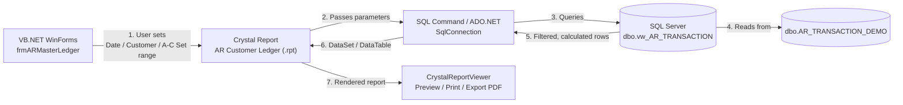
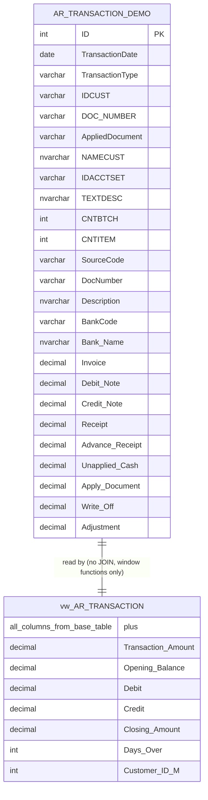

# 📊 AR Master Ledger (Customer Ledger Report)

A **VB.NET (WinForms) + Crystal Reports + SQL Server** desktop application that generates a professional, print-ready **Accounts Receivable (AR) Customer Ledger** report — with date range, customer range, and account-set range filters — replicating the look and logic of a real ERP AR module.

> ⚠️ **Disclaimer:** This is a **demo / portfolio project**. No real company, customer, or transaction data is used anywhere in this repository. All company names, customer names, invoice numbers, and amounts are **fictional dummy data** generated only to demonstrate the report design and SQL logic. In the original production system this report is based on, the underlying ERP database has **300+ tables**; for this public demo, that data model has been **simplified down to a single flat table + one SQL view** so the logic can be shared safely without exposing proprietary schema or client data.

---

## 🖼️ Screenshots

### Main Report Parameter Form
 |

*The form lets the user filter by From/To Date, From/To Customer ID, From/To A/C Set ID, and an optional "Customer Detail Journals" toggle before clicking **Show Report**.*

### Report Output — Without "Customer Detail Journals" (Summary View)

| Parameters used | Report output |
|---|---|
|  | 
 />
 |

With the checkbox left **unchecked**, the report shows one summarized line per customer per Account Set — just the running Opening → Debit → Credit → Closing balance, no individual transactions.

### Report Output — With "Customer Detail Journals" (Detail View)

| Parameters used | Report output |
|---|---|
| | 
 |

With the checkbox **checked**, the report expands each customer to show every individual transaction (invoice, receipt, credit note, etc.) that makes up the balance — this is the view shown in the [sample PDF](#sample-generated-report-crystal-reports-pdf-export) below.

### Sample Generated Report (Crystal Reports PDF export)

### Sample Generated Report (Crystal Reports PDF export)

📄 See [`AR_Master_Ledger/docs/customer ledger dummy with details.pdf`](AR_Master_Ledger/docs/customer%20ledger%20dummy%20with%20details.pdf) — full detail-journal export (dummy data, transaction-level, with running Opening/Debit/Credit/Closing balances and a grand total).

📄 See [`AR_Master_Ledger/docs/customer ledger dummy without details.pdf`](AR_Master_Ledger/docs/customer%20ledger%20dummy%20without%20details.pdf) — summarized export (one line per customer per Account Set, no individual transactions).
> 📌 **Add your own screenshots/video here** — see the [📸 Media / Demo section](#-media--demo-add-your-own) below for exactly where to drop new files.

---

## ✨ Features

- Filter by **Date Range**, **Customer ID Range**, and **A/C Set ID Range**
- Optional **Customer Detail Journals** view (transaction-level detail vs. summary)
- Automatic **Opening Balance → Debit → Credit → Closing Balance** running totals per customer
- Grouped subtotals by **Account Set** (e.g. Commercial / Corporate / Retail) and grand totals for the whole report
- **"Days Over"** (ageing) calculation for invoices
- Built with **Crystal Reports for VB.NET**, so it can be previewed, printed, or exported (PDF/Excel/Word) directly from the WinForms viewer
- Powered by a single **SQL Server view** (`vw_AR_TRANSACTION`) that does all the balance-calculation logic, so the report itself stays simple

---

## 🧰 Tech Stack

| Layer | Technology |
|---|---|
| UI / Application | VB.NET (Windows Forms, .NET Framework) |
| Reporting Engine | SAP Crystal Reports for Visual Studio |
| Database | Microsoft SQL Server (T-SQL) |
| Data Access | ADO.NET (`SqlConnection` / `SqlCommand` / `SqlDataAdapter`) or Crystal's built-in SQL Command / ADO.NET dataset |
| Report Data Source | SQL View: `dbo.vw_AR_TRANSACTION` |

---

## 🗄️ Database Design — Tables, Columns & Joins

This is the part most people ask about, so here it is in full detail.

### 1. Table used

Only **one physical table** is used in this demo:

```
dbo.AR_TRANSACTION_DEMO
```

In the real/original system this report was modeled after, this same information is normally assembled by joining **many** ERP tables (AR transaction header/detail, customer master, account set master, bank master, currency, batch/entry control tables, etc. — 300+ tables exist in that full schema). For this public demo, all of that has been **pre-flattened into one demo table** so the SQL can be shared without exposing the real schema.

### 2. Columns in `AR_TRANSACTION_DEMO`

| Column | Data Type | Meaning |
|---|---|---|
| `ID` | `INT IDENTITY` | Surrogate primary key |
| `TransactionDate` | `DATE` | Date of the transaction |
| `TransactionType` | `VARCHAR(50)` | Invoice / Receipt / Credit Note / Debit Note / Advance Receipt / Unapplied Cash / Apply Document / Write-Off / Adjustment |
| `IDCUST` | `VARCHAR(20)` | Customer ID (e.g. `CUST-101`) |
| `[DOC NUMBER]` | `VARCHAR(30)` | Document number of the entry itself |
| `AppliedDocument` | `VARCHAR(30)` | The document this entry is applied against (e.g. a receipt applied to an invoice) |
| `NAMECUST` | `NVARCHAR(100)` | Customer name |
| `IDACCTSET` | `VARCHAR(10)` | Account Set ID (e.g. `AC-COMM`, `AC-CORP`, `AC-RTL`) |
| `TEXTDESC` | `NVARCHAR(50)` | Account Set description (e.g. "Commercial Accounts") |
| `CNTBTCH` | `INT` | Batch number |
| `CNTITEM` | `INT` | Entry number within the batch |
| `SourceCode` | `VARCHAR(10)` | Transaction source code (`AR-IN`, `AR-PY`, `AR-CR`, `AR-DN`, `AR-PI`, `AR-UC`, `AR-AD`, `AR-WO`) |
| `DocNumber` | `VARCHAR(30)` | The invoice/document number this transaction relates to |
| `Description` | `NVARCHAR(255)` | Free-text entry description |
| `BankCode` / `[Bank Name]` | `VARCHAR(10)` / `NVARCHAR(100)` | Bank used for receipts/payments |
| `Invoice` | `DECIMAL(19,3)` | Invoice amount |
| `[Debit Note]` | `DECIMAL(19,3)` | Debit note amount |
| `[Credit Note]` | `DECIMAL(19,3)` | Credit note amount |
| `Receipt` | `DECIMAL(19,3)` | Receipt/payment amount |
| `[Advance Receipt]` | `DECIMAL(19,3)` | Advance received from customer |
| `[Unapplied Cash]` | `DECIMAL(19,3)` | Cash received but not yet applied to an invoice |
| `[Apply Document]` | `DECIMAL(19,3)` | Amount used when an advance is applied to an invoice |
| `[Write-Off]` | `DECIMAL(19,3)` | Bad-debt / balance write-off amount |
| `Adjustment` | `DECIMAL(19,3)` | Manual adjustment (rounding, tax correction, etc.) |

### 3. Joins used — **there are none** (and why)

This demo intentionally uses **zero JOINs**. The single table above already contains everything the report needs (customer name, account set description, bank name, all amount buckets), because it stands in for what would otherwise be a multi-table join across the customer master, account-set master, bank master, and transaction header/detail tables in a real ERP.

All the "smart" work happens in a **SQL View** using **window functions**, not joins:

```sql
dbo.vw_AR_TRANSACTION
```

### 4. What the view (`vw_AR_TRANSACTION`) actually does

The view wraps the table in a CTE (`CalculatedLedger`) and computes:

| Calculated Column | Formula (simplified) | Purpose |
|---|---|---|
| **Transaction Amount** | `Invoice − DebitNote + CreditNote − Receipt − AdvanceReceipt − UnappliedCash − ApplyDocument − WriteOff + Adjustment` | Net effect of one row on the customer's balance |
| **Opening Balance** | `SUM(Transaction Amount)` using `OVER (PARTITION BY IDCUST ORDER BY TransactionDate, CNTBTCH, CNTITEM ROWS BETWEEN UNBOUNDED PRECEDING AND 1 PRECEDING)` | Running balance **before** this row, per customer |
| **Closing Amount** | Same window function but `ROWS BETWEEN UNBOUNDED PRECEDING AND CURRENT ROW` | Running balance **including** this row |
| **Debit** | `CASE WHEN Transaction Amount > 0 THEN Transaction Amount ELSE 0` | Splits the net amount into a Debit column for display |
| **Credit** | `CASE WHEN Transaction Amount < 0 THEN ABS(Transaction Amount) ELSE 0` | Splits the net amount into a Credit column for display |
| **Days Over** | `DATEDIFF(DAY, TransactionDate, GETDATE())` only when `SourceCode = 'AR-IN'` | Ageing (days overdue) for invoices only |
| **Customer_ID_M** | `TRY_CONVERT(INT, REPLACE([Customer ID], 'CUST-', ''))` | Numeric version of the Customer ID, used for sorting/range filtering (`From/To Customer ID`) |

So instead of `GROUP BY` + multiple joined subqueries, this uses **`SUM(...) OVER (PARTITION BY ... ORDER BY ...)`** — a running-total window function — which is what lets Crystal Reports simply consume the view row-by-row and print Opening/Debit/Credit/Closing without doing any balance math inside the report itself.

### 5. Parameters used by the Crystal Report / VB.NET form

These map directly to the WHERE clause applied on top of `vw_AR_TRANSACTION` when the **Show Report** button is clicked:

| Form Field | Maps to View Column | Type |
|---|---|---|
| From Date / To Date | `TransactionDate` | Date range |
| From Customer ID / To Customer ID | `Customer_ID_M` (or `[Customer ID]`) | Range |
| From A/C Set ID / To A/C Set ID | `[Account Set ID]` | Range |
| Customer Detail Journals (checkbox) | Controls whether the report shows transaction-level detail or a summarized ledger | Boolean toggle |

---

## 🏗️ Architecture / How It Works





---

## 📁 Project Structure

> This is a **suggested / typical** structure for a VB.NET + Crystal Reports solution like this one. Rename folders/files to match your actual solution — the important part is keeping SQL, Reports, Forms, and Docs separated like this so the repo stays easy to navigate.

```
AR_Master_Ledger/
│
├── AR_Master_Ledger.sln                 # Visual Studio solution file
├── AR_Master_Ledger.vbproj              # VB.NET project file
│
├── Forms/
│   ├── frmARMasterLedger.vb             # Main parameter form (screenshot above)
│   └── frmARMasterLedger.Designer.vb
│
├── Reports/
│   └── rptARCustomerLedger.rpt          # Crystal Report definition
│
├── Modules/
│   ├── modDatabaseConnection.vb         # SqlConnection / connection string handling
│   └── modReportHelper.vb               # Passes parameters to Crystal Report, opens viewer
│
├── SQL/
│   └── Demo_AR_Customer_Ledger.sql      # Table + View creation script (this repo's SQL)
│
├── docs/
│   ├── ar_demo_customer.pdf             # Sample exported report (dummy data)
│   └── Demo_AR_Customer_Ledger.sql
│
├── screenshots/
│   └── ar-master-ledger-form.png        # Form screenshot used in this README
│
├── media/                                # 👉 put demo video / GIF here (see below)
│
├── .gitignore
├── LICENSE
└── README.md                             # you are here
```

---

## 🚀 Getting Started

### Prerequisites
- Visual Studio (2019/2022) with **VB.NET** and **Crystal Reports for Visual Studio** runtime/SDK installed
- Microsoft SQL Server (2016+) — Express edition is fine for testing
- SQL Server Management Studio (optional, for running the script manually)

### Setup
1. Restore the database:
   ```sql
   -- Run this in SSMS or via sqlcmd
   :r SQL/Demo_AR_Customer_Ledger.sql
   ```
   This will create `Demo_Database`, the `AR_TRANSACTION_DEMO` table, insert dummy demo rows, and create the `vw_AR_TRANSACTION` view.
2. Update the connection string in `modDatabaseConnection.vb` to point to your SQL Server instance.
3. Open `AR_Master_Ledger.sln` in Visual Studio, restore/build.
4. Run the project → the **AR Master Ledger** form (see screenshot) will open.
5. Pick a date range / customer range / A-C set range → click **Show Report**.

---

## 📸 Media / Demo (add your own)

This section is a placeholder so future contributors (or future-you) know exactly where to drop new media when updating the repo:

| What to add | Where to put it | How to reference it in README |
|---|---|---|
| New/updated form screenshots | `screenshots/` | `` |
| Report output samples (PDF/PNG) | `docs/` | Link as `[Sample Report](docs/your-file.pdf)` |
| Demo video (screen recording of the app running) | `media/` | Upload to YouTube/Drive and embed a thumbnail: `[](https://your-video-link)` — GitHub READMEs can't autoplay video files directly, so a clickable thumbnail linking out works best |
| Short GIF walkthrough | `media/demo.gif` | `` |

*(Once you record a walkthrough, just drop the file in `media/` and swap this table's placeholder text for the real embed.)*

---

## 🔒 Data Privacy Note

- ✅ All customer names, invoice numbers, dates, and amounts in this repository (SQL script, PDF sample, and screenshots) are **synthetically generated dummy data**.
- ❌ **No real client, customer, or company data** has been used or exposed at any point in this project.
- The 300+ table production schema this design is based on is **not** included here — only a simplified single-table + view version, built purely to demonstrate the report/query logic publicly.

---

## 🐙 How to Push This Project to GitHub (step-by-step)

If you haven't put this project on GitHub yet, here's the full guide:

### 1. Create the repository on GitHub
1. Go to [github.com](https://github.com) and log in.
2. Click the **`+`** icon (top right) → **New repository**.
3. Fill in:
   - **Repository name**: e.g. `ar-master-ledger`
   - **Description**: "VB.NET + Crystal Reports + SQL Server demo — AR Customer Ledger report"
   - Choose **Public** or **Private**
   - ✅ Check **Add a README file** — *or leave it unchecked since you already have this one*
   - Add a `.gitignore` template: choose **VisualStudio** (it already excludes `bin/`, `obj/`, `.vs/`, etc.)
   - Choose a license (e.g. MIT) if you want it open-source
4. Click **Create repository**.

### 2. Initialize Git locally (in your project folder)
Open a terminal / Git Bash / VS Code terminal in your project folder and run:

```bash
git init
git add .
git commit -m "Initial commit: AR Master Ledger (VB.NET + Crystal Reports + SQL Server)"
```

### 3. Connect your local folder to the GitHub repo
Copy the remote URL from your new GitHub repo page (it looks like `https://github.com/your-username/ar-master-ledger.git`), then:

```bash
git branch -M main
git remote add origin https://github.com/your-username/ar-master-ledger.git
git push -u origin main
```

### 4. Day-to-day workflow after that
Every time you make changes:

```bash
git add .
git commit -m "Describe what you changed"
git push
```

### 5. Recommended `.gitignore` additions for VB.NET + Crystal Reports projects
Make sure these are ignored (Visual Studio's default template usually already covers most):

```gitignore
bin/
obj/
.vs/
*.user
*.suo
*.cache
packages/
*.rpt.data     # cached Crystal Reports data (not the .rpt design file itself)
```

### 6. Tips for a good public repo
- Keep the actual `.rpt` file in the repo (it's your report design) but never commit real production data.
- If your connection string has real server names/passwords, move it to a config file and add that file to `.gitignore` — don't hardcode secrets.
- Add topics/tags on GitHub like `vbnet`, `crystal-reports`, `sql-server`, `accounts-receivable`, `erp` so people can find it.
- Pin this repo on your GitHub profile if it's a good portfolio piece — the screenshots + PDF sample above make it easy for a recruiter to understand the project in 30 seconds.

---

## 📄 License

Add your preferred license here (MIT recommended for portfolio projects).

---

## 🙋 Support / Questions

Feel free to open an [Issue](../../issues) on this repository if something doesn't run as expected, or you want to suggest an improvement.
